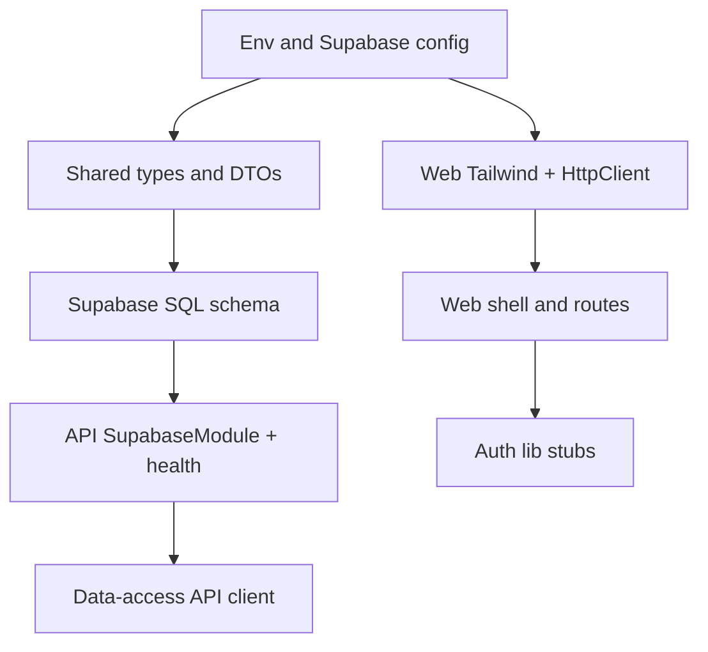

# Kanban App: Basics and First Steps (Phase 1)

Complete Phase 1 setup (Supabase, env, structure) and prepare foundational pieces for Phase 2 (auth), aligned with the spec roadmap and Angular/NestJS conventions.

---

## Current State

The monorepo is scaffolded with:

- **apps/web** — Angular 21 (standalone), minimal shell with NxWelcome
- **apps/api** — NestJS 11, single AppController/AppService
- **libs** — shared, ui, data-access, auth (mostly placeholder)
- **web-e2e** — Playwright with placeholder test

Missing for Phase 1: Supabase connection, environment config, Tailwind, HttpClient, and cleanup of starter boilerplate.

---

## Phase 1 — Setup (First Steps)

### 1. Environment and Supabase Config

**Create `.env.example`** in the project root with:

- `SUPABASE_URL` and `SUPABASE_ANON_KEY`
- `JWT_SECRET` (for NestJS JWT signing)
- `DATABASE_URL` (PostgreSQL connection string for API)
- `API_URL` (e.g. `http://localhost:3000/api` for web app)

Document in README that users copy `.env.example` to `.env` and fill in values.

**Database choice:** Use **Supabase client** (`@supabase/supabase-js`) in NestJS for initial setup. Optionally add Prisma or TypeORM later if you prefer a full ORM.

**Install:** `@supabase/supabase-js` in the API app and configure a `SupabaseModule` that exports a `SupabaseService` for DB access.

---

### 2. Shared Types and DTOs (`libs/shared`)

Replace the placeholder with domain models (data-only, readonly per [rules-angular.md](rules-angular.md)):

- **User** — `id`, `email`, `name`, `role`
- **Project** — `id`, `name`, `description`, `createdAt`
- **ProjectMember** — `projectId`, `userId`, `role` (Admin | Member)
- **Task** — `id`, `projectId`, `title`, `status`, `assigneeId`, `dueDate`, `priority`
- **TaskStatus** — enum: `ToDo`, `InProgress`, `Done`
- **Role** — enum: `Admin`, `Member`
- **Priority** — enum (e.g. Low, Medium, High)

Export these from `libs/shared/src/index.ts`. No methods; types/models only.

---

### 3. API — Supabase and Module Layout

- **SupabaseModule** — Provides `SupabaseService` using `DATABASE_URL` (or Supabase project URL + key). Place in `apps/api/src/app/supabase/`.
- **Update `AppModule`** — Import `SupabaseModule`.
- **Health endpoint** — Add `GET /api/health` to verify API + DB connectivity.

Structure for future modules:

```
apps/api/src/app/
  supabase/         # SupabaseModule, SupabaseService
  auth/             # (Phase 2)
  users/            # (Phase 2)
  projects/         # (Phase 3)
  tasks/            # (Phase 3)
  ...
```

---

### 4. Web App — Core Setup

**Tailwind CSS**

- Install and configure Tailwind in `apps/web` per [rules-angular.md](rules-angular.md).
- Add Tailwind directives to `apps/web/src/styles.css`.

**HttpClient**

- Add `provideHttpClient()` to `apps/web/src/app/app.config.ts`.

**Clean shell**

- Remove `NxWelcome` from `apps/web/src/app/app.ts` and template.
- Use a minimal shell: header/branding + `<router-outlet>`.
- Ensure `App` class name, `app-root` selector, and external `templateUrl`/`styleUrl` per rules.

**Base layout**

- Create `apps/web/src/app/layout/` with a simple `ShellComponent` (header + outlet).
- Root route `''` → Shell with outlet; prepare lazy routes for `/login`, `/register`, `/projects` (Phase 2+).

---

### 5. Data-Access Library

- Refactor `libs/data-access` from placeholder component to **API client services**.
- Add `ApiConfig` (or inject config) for `API_URL`.
- Add `ApiService` or `HttpClient` wrapper that prefixes requests with `API_URL`.
- Export from `libs/data-access/src/index.ts` for use in web app.

---

### 6. Auth Library (Structure Only)

- In `libs/auth`, add `AuthGuard` and `AuthInterceptor` stubs (no logic yet).
- `AuthGuard` — returns `false` / redirects to login (placeholder).
- `AuthInterceptor` — will attach JWT to requests; for now, just pass-through.
- Export from `libs/auth/src/index.ts`.

---

### 7. Supabase Schema (SQL)

Create a migration or SQL script (e.g. in `docs/` or `apps/api/db/`) for initial schema:

- `users` — id, email, password_hash, name, role, created_at
- `projects` — id, name, description, created_at
- `project_members` — project_id, user_id, role
- `tasks` — id, project_id, title, status, assignee_id, due_date, priority, created_at
- `comments` and `activity_logs` can be added in Phase 5

Run this in Supabase SQL editor to bootstrap the database.

---

## Suggested Order of Implementation



1. `.env.example` and README update
2. Shared types in `libs/shared`
3. Supabase SQL schema
4. API: SupabaseModule, SupabaseService, health endpoint
5. Web: Tailwind, HttpClient, shell cleanup, base routes
6. Data-access: API client with config
7. Auth lib: guard and interceptor stubs

---

## Out of Scope (Later Phases)

- Phase 2: Login/register, JWT, protected routes
- Phase 3: Projects and tasks CRUD
- Phase 4: Kanban drag-and-drop UI
- Phase 5: Comments, activity log
- Phase 6: Playwright E2E flows, CI, deployment

---

## Key Files to Touch

| Area        | Files                                                                               |
| ----------- | ----------------------------------------------------------------------------------- |
| Env         | `.env.example`, README                                                              |
| Shared      | `libs/shared/src/lib/*.model.ts`, `libs/shared/src/index.ts`                        |
| DB          | `docs/schema.sql` or `apps/api/db/schema.sql`                                       |
| API         | `apps/api/src/app/supabase/`, `AppModule`                                           |
| Web         | `app.config.ts`, `app.ts`, `app.html`, `styles.css`, `app.routes.ts`, new `layout/` |
| Data-access | `libs/data-access/src/lib/` (API service)                                           |
| Auth        | `libs/auth/src/lib/` (guard, interceptor stubs)                                     |

c
